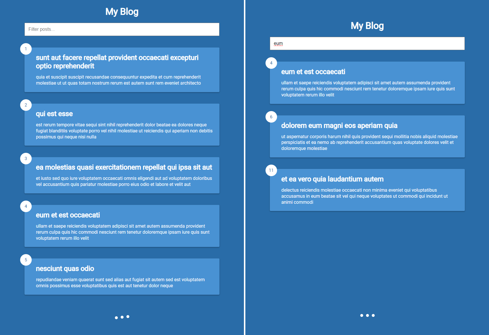
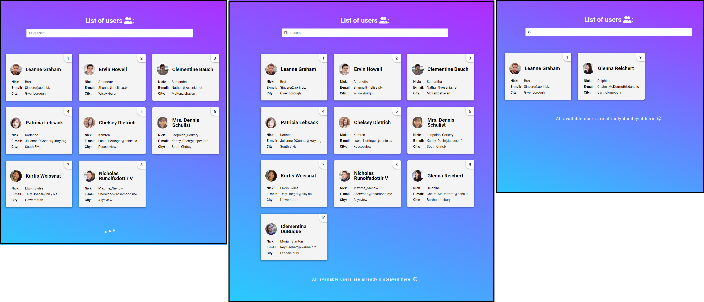

# Udemy--vanillawebprojects-11

**Eleventh out** of a series of **20 small projects** in **Vanilla JavaScript** from the [**Udemy course**](https://www.udemy.com/course/web-projects-with-vanilla-javascript/) by author [Brad Traversy](https://www.traversymedia.com/) with this [Brad's original GitHub repository](https://github.com/bradtraversy/vanillawebprojects).

# 11: Infinite Scrolling

Display blog posts from [jsonplaceholder] (https://jsonplaceholder.typicode.com/) and add infinite scroll to fetch posts and also add filter box

## Project Specifications

- Create **UI** & custom CSS loader animation
- **Fetch initial posts** from API and display
- Scroll down, show loader and **fetch next set of posts**
- Add **filtering** for fetched posts

## Original preview

    

## My solution preview

    

## My solution features

- Custom **UI/UX design**
- If the user **scrolls down**, a ‘loading’ animation appears, which disappears while a fetch request is sent to load the next group of users.
- Unfortunately, **only 10 users are available in API**, so once they are all loaded, a **message for the user appears** at the bottom of the page. 
- The **search works the same as in the original** - it searches for **names** in the names of users who are currently loaded.

# Author

Website - [Petr Bednarski](https://github.com/pettik)  
Frontend Mentor - [@pettik](https://www.frontendmentor.io/profile/pettik)
